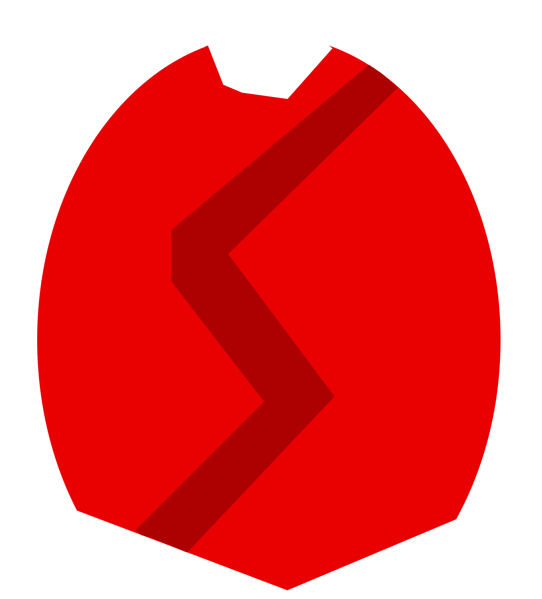

#  GEMS NT
GEMS is Essentially Maybe Spinel *Next Technologies.*
*Note: This is not Spinel, we are just trying to be better. ;)*

## Important notices!

In order to contribute, you must follow the [Sparksammy C.O.C.](https://github.com/sparksammy/sparksammycoc)

*Also: Since the current version of MIV for Cosmos (at the time I got it) did not have a LICENSE, and I just found out that means that MIV is "All rights reserved", I have removed MIV, will replace with my own Text Editor.*

## Requirements

Required to build:
* Visual Studio 2019 w/ C#
* [Cosmos OS User Kit](https://github.com/CosmosOS/Cosmos/releases)

Required to use:
  * VMWare. (Ok, it's not required, but it will most likely break your main operating system and/or erase your data if you don't)
  * The VMWare image provided [here](https://github.com/sparksammy/GEMS-NT/releases/download/0.43aSR/Filesystem.vmdk)
  * [The latest release of GEMS NT.](https://github.com/sparksammy/GEMS-NT/releases/)

*NOTE: Make sure you have Visual Studio closed while installing Cosmos!*

# How to build.
* Install COSMOS
* After installed, go to Debug build settings, change build to ISO, then goto Cosmos (new), and finally then disable Debuging.
* When that's done, just build it and enjoy. *In VMWare, of course! :)*

## VM building instructions
* Create an Other 64bit VM with at least 256MB virtual RAM
* Replace HDD IDE image with the one provided
* Replace CD Image with GEMS NT

## Benefits of using NT over the old GEMS?
* More modern, simple, and easy code!
* Easy to use and compile!
* Clear fixed!
* You can finally input commands! (Type cmds for commands!)
* Text doesn't wrap around to the top!
* A filesystem!
* All of this (and maybe even more) thanks to Cosmos!

## Links to useful resources:
[SamLang Manual](https://github.com/sparksammy/GEMS-NT/blob/master/SAMLANG.md)

## Fun facts
The GEMS team has an internal function to play notes. It goes something like this:
``PCSpeaker.PCSpeaker.play(PCSpeaker.PCSpeaker.notes.D3, 1000);``

Also, I (Sparksammy) mispelled "micro.cs" as "macro.cs", I left it in there because I thought it was funny. :o) 

Fun fact 3: The GEMS logo is a cross between A Spinel (the mineral) with a crack in the shape of an "S", and a heart, to show that this is a Homage to Sparkpin and her Spinel OS. Also: The SamLang logo is a cross between a shield, a gem, as well as the initials for SamLang, S.L. (Symbolized as SL)
